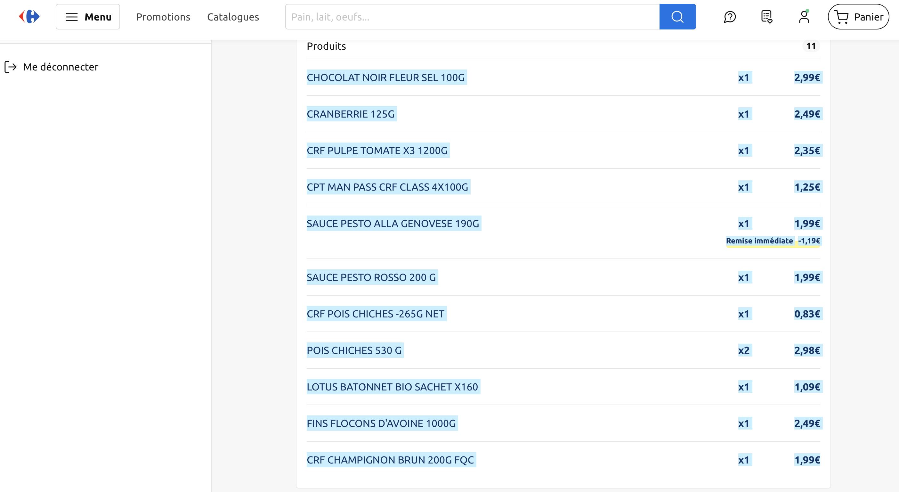

# Bill splitting app

## Goal:

Repo for a Python tkinter based bill splitting app. Takes a very specific type of input. Carrefour bills from the website or the app.

## Features:

1. Retrieve each line of a bill (apply the immediate discount on each product).
2. Possibility to divide the contribution across people using checkboxes.
3. Computes the total contribution per person taking into account potential additional discounts.
4. Possibility to choose how to split global discounts.Either equally for each person or proportionally to each individual contribution (less fair as it counts individual purchases in global discount splitting).

## How to use it:

### Using the executable :
A. Using the user interface
1. Go on Carrefour's website $\rightarrow$ "Mes achats" $\rightarrow$ "Mes tickets de caisse".
2. Choose a bill and click on "Voir le détail"
3. Click on "X articles"
4. Copy all the articles info as in the example on the following image: 
6. Put the copied text in the input cell of the app ```tkinter_interface```. An example raw text is given in the ```ìnvoice_example.txt``` file.

B. Using the HTML source code
1. Go on Carrefour's website $\rightarrow$ "Mes achats" $\rightarrow$ "Mes tickets de caisse".
2. Choose a bill and click on "Voir le détail"
3. Click on "X articles"
4. Right click on the page and inspect it.
5. Find the div that covers the list of products only with div class called ```c-accordion offline-order-detail__products-list```
6. Copy its content by doing a right click on this div -> copy element.
7. Put the copied text in the input cell of the app ```tkinter_interface```.

### Using the python file

1. Ensure to have Python > 3.9 and tkinter installed.
2. Run the ```tkinter_interface.py``` script
3. Follow the steps of "Using the executable" section

## Install the executable on Windows

The given executable works on MacOS. You can create an app compatible with your own os using ```pyinstaller``` by running the following command after having installed the pyinstaller Python package:

```pyinstaller --onefile tkinter_interface.py```

The app will be created in a ```dist``` folder.

## To be done:

- Freedom on the people considered. Being able to add remove columns. Hard coded right now.
- More precise contribution (percentage) ?
- API $\rightarrow$ scrap the bill info directly.
- Adjust perfectly the rounding errors. 
